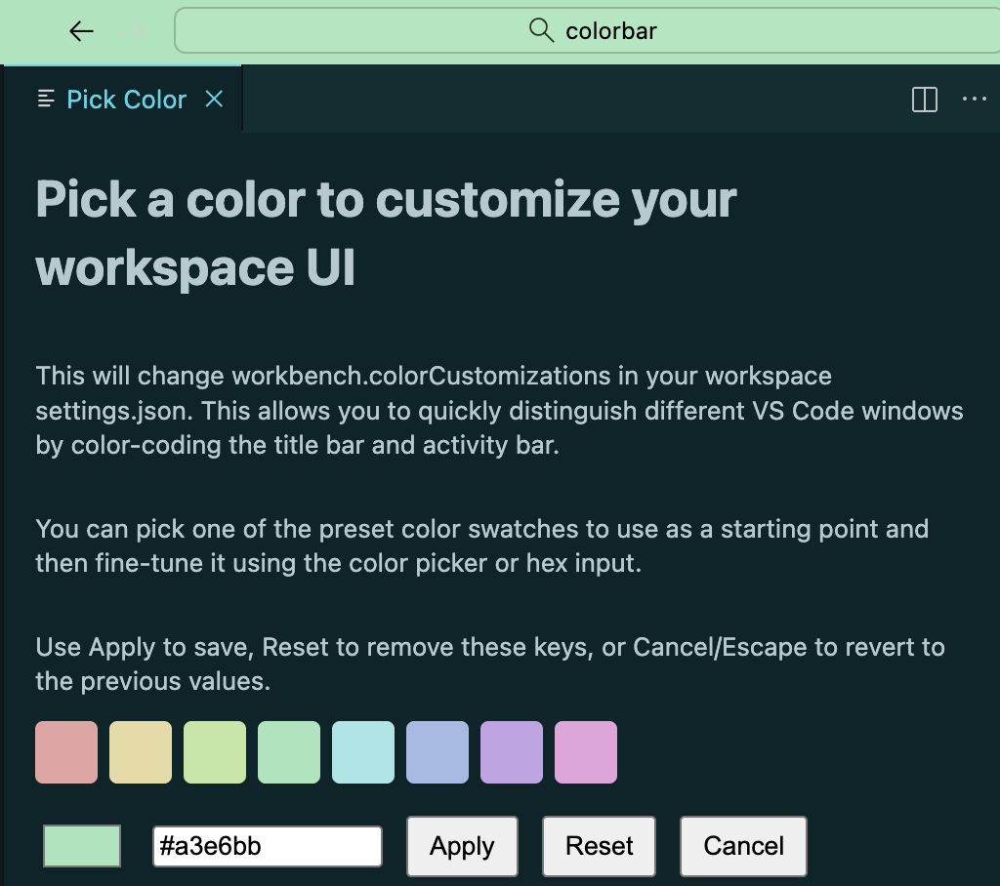

# Colorbar

Quickly customize your VS Code workspace colors to visually distinguish between different projects and windows.

## Features

**Color-code your workspaces** to instantly identify which project you're working on. Colorbar applies custom colors to your title bar and activity bar, making it easy to manage multiple VS Code windows.

- Interactive color picker: with live preview
- Instant visual feedback: as you choose colors
- Smart contrast detection: ensures text remains readable
- Workspace-specific: settings that persist across sessions
- One-click reset: to restore default colors

## Usage

1. Open the Command Palette (`Cmd+Shift+P` on macOS, `Ctrl+Shift+P` on Windows/Linux)
2. Type **"Colorbar: Apply Workspace Color Customizations"**
3. Pick a color using the interactive picker
4. See the changes instantly in your workspace
5. Click **Apply** to save, **Reset** to clear, or **Cancel** to revert

The extension modifies `workbench.colorCustomizations` in your workspace's `.vscode/settings.json`, allowing you to maintain different color schemes for each project.

## Why Colorbar?

When working with multiple VS Code windows across different projects, it's easy to lose track of which window belongs to which project. Colorbar solves this by letting you assign a unique color to each workspace's title bar and activity bar.

Perfect for:
- Managing multiple client projects
- Switching between development and production codebases
- Organizing personal and work projects
- Color-coding by language, framework, or project type

## Commands

- `colorbar.apply` - **Colorbar: Apply Workspace Color Customizations**

## What Gets Customized?

Colorbar automatically sets the following theme colors:
- `titleBar.activeBackground` - Active title bar background
- `titleBar.inactiveBackground` - Inactive title bar background (with transparency)
- `titleBar.activeForeground` - Title bar text color (auto-contrasted)
- `titleBar.inactiveForeground` - Inactive title bar text color
- `activityBar.background` - Activity bar background
- `activityBar.foreground` - Activity bar icon color
- `activityBar.activeBackground` - Active activity bar item background

## Requirements

- VS Code 1.103.0 or higher (Because the extension uses settings that have been around for a while, it probably works with older versions as well, but I haven't tested it.)

## License

MIT - See [LICENSE.md](LICENSE.md) for details.

## Issues & Contributions

Found a bug or have a feature request? Please open an issue on [GitHub](https://github.com/mwartell/colorbar/issues).

## Safety and Transparency

- **Code footprint:** The implementation is a [single TypeScript file][ts] responsible for reading settings and applying `workbench.colorCustomizations`. No additional runtime scripts or bundled native code are included.
- **Permissions:** No file system, network, telemetry, shell, or debug APIs are used. The extension does not read your code, modify files, or send data anywhere.
- **Telemetry:** No analytics or tracking is collected. There are no calls to remote endpoints.
- **Build transparency:** The published package is built with the standard VS Code extension tooling. You can reproduce the build locally and compare the resulting `.vsix`.
- **Changelog discipline:** Changes are documented release by release so you can verify that no new capabilities or sensitive APIs were added unexpectedly.
- **Security reporting:** Vulnerabilities or concerns can be reported via the repository’s issue tracker. Responsible disclosure is appreciated.

[ts]: ./src/extension.ts
